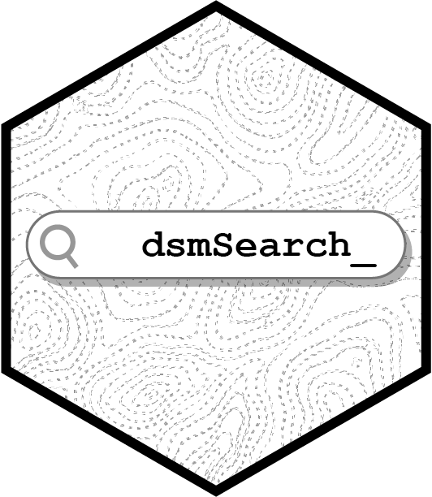

<!-- badges: start -->
[](https://zenodo.org/doi/10.5281/zenodo.10594151)
[](https://github.com/land-info-lab/dsmSearch/actions/workflows/R-CMD-check.yaml)
[](https://CRAN.R-project.org/package=dsmSearch)
<!-- badges: end -->

# dsmSearch

<p align="left">



</p>

The package dsmSearch offers functions for retrieving high-resolution Digital Surface Models (DSM) and Light Detection and Ranging (LiDAR) data, providing a toolkit to collect remote sensing data effectively for research and analysis in fields such as ecology, geography, urban planning, and forestry.

## Installation

The dsmSearch R pacakge can currently be installed via github.

``` r
install.packages('dsmSearch')
```

## Usage

Download ALOS Global Digital Surface Model (30 meter) via OpenTopography
API based on coordinates of a spatial point with a given distance or
bounding box.

Note: The dataset requires API key for access. Users can request an API
key via myOpenTopo in the OpenTopography portal. \* See OpenTopography
[Terms of
Use](https://opentopography.org/usageterms#:~:text=You%20agree%20to%2C%20and%20will,and%20their%20OpenTopography%20accounts%20closed.&text=We%20retain%20the%20right%20to,who%20abuse%20the%20system%20intentionally.)
for more information on appropriate use of the API.

``` r
# download DSM raster using bbox
data <- dsmSearch::get_dsm_30(bbox = c(-83.783557,42.241833,-83.696525,42.310420), key = "you key")
# download DSM raster using buffer
data <- dsmSearch::get_dsm_30(x = -83.741289, 
                              y = 42.270146, 
                              r = 5000, 
                              epsg = 2253,
                              key = "your key")
```

Baesd on the TNMAccess API, LiDAR search facilitate the retrieval and
exploration of LiDAR (Light Detection and Ranging) data (from USGS)
within a specified bounding box (bbox). This function enables users to
search for LiDAR data, preview available graphics, and optionally
download LiDAR data files for DSM/DTM and further data analysis. Current
dataset of USGS covers the most area in the US:
<https://apps.nationalmap.gov/lidar-explorer/#/>

``` r
# search for lidar data information using bbox
search_result <- dsmSearch::lidar_search(bbox = c(-83.742282,42.273389,-83.733442,42.278724), preview = TRUE)
#> Get 5 returns
#> Find available items: 5
```


For more information and examples of the functions check out the
[package
vignette](https://github.com/land-info-lab/dsmSearch/blob/master/vignettes/dsmSearch.Rmd).

## Citation

```r
citation("dsmSearch")
```
```
To cite package ‘dsmSearch’ in publications use:

  Xiaohao Yang, Lindquist, M., Van Berkel, D., & Fox, N. (2024). dsmSearch: R package for
  downloading DSM and LiDAR data via APIs (v1.0.0). Zenodo.
  https://doi.org/10.5281/zenodo.10594152

A BibTeX entry for LaTeX users is

  @Manual{,
    title = {dsmSearch: R package for downloading DSM and LiDAR data via APIs (v1.0.0)},
    author = {Xiaohao Yang and Mark Lindquist and Derek {Van Berkel} and Nathan Fox},
    publisher = {Zenodo},
    year = {2024},
    note = {(Version 1.0.0)},
    url = {https://doi.org/10.5281/zenodo.10594152},
  }
```

## Issues and bugs

If you discover a bug not associated with connection to the API that is
not already a [reported
issue](https://github.com/land-info-lab/dsmSearch/issues), please [open
a new issue](https://github.com/land-info-lab/dsmSearch/issues/new)
providing a reproducible example.
